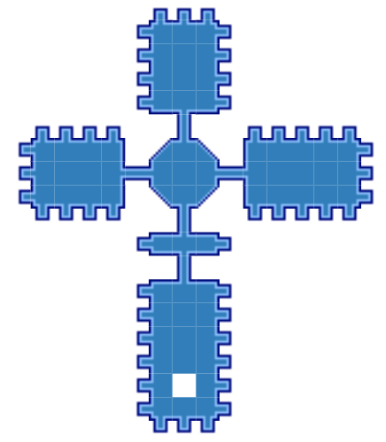

# acdungeonmaps

Dungeon maps for Asheron's Call in a browser. See [https://dungeonmaps.vercel.app/](https://dungeonmaps.vercel.app/).



Based largely on work done by [Rawaho](https://github.com/Rawaho/) on [Pegasus](https://github.com/Rawaho/Pegasus/), [trevis on UtilityBelt](https://gitlab.com/utilitybelt/utilitybelt.gitlab.io/), and [ACE](https://acemulator.github.io/). Help in getting this working by parad0x and trevis.

## Data Sources

- `data/dungeons.csv`: Not sure
- `data/vi2dungeons.csv`: <http://www.virindi.net/vstats/dungeonnames.php>

## Development

### Database

The database is created from two files,

- `data/dungeons.csv`
- `data/tiles.csv`

To create (or update) the database, first install the required Python packages with:

```
python -m pip install -r requirements.txt
datasette install datasette-publish-vercel
```

```
csvs-to-sqlite --replace-tables data/*csv data/dungeonmaps.sqlite
```

Then publish to Vercel:

```
datasette publish vercel -m data/metadata.json -p dungeonmapsdb data/dungeonmaps.sqlite
```

### Website
